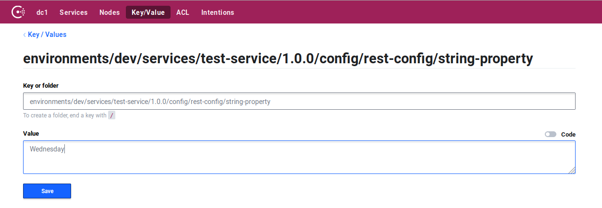

# KumuluzEE Go Config

> read local or remote configuration in kumuluzEE format.

The goal of this sample is to demonstrate how to use package for configuration in Go. The tutorial will guide you through the necessary steps. 

## Requirements

In order to run this sample you will need:
1. Go version >= 1.10.0 installed (suggested, this is version package is tested in)
    * If you have Go installed, you can check your version by typing the following in command line:
    ```
    $ go version
    ```
2. Git:
    * If you have installed Git, you can check the version by typing the following in a command line:
    ```
    $ git --version
    ```
  
## Prerequisites

We assume a working Go installation with set `$GOPATH` environment variable that points to Go's workspace.
You should know where your `$GOPATH` variable is pointing at. By default, it would be `$HOME/go` on Linux or `C:\go` on Windows.

To run this sample you will need a Consul instance. Note that such setup with only one Consul node is not viable for 
production environments, but only for developing purposes. Here is an example on how to quickly run a Consul instance with docker:
```bash
$ docker run -d --name=dev-consul --net=host consul
```

It is also recommended that you are familiar with Go programming language and it's toolchain.

## Usage

You can download these samples by running:
```bash
go get github.com/kumuluz/kumuluzee-go-samples/...
```

This will download samples and all their dependencies. Samples will be availiable in Go's workspace, under `$GOPATH/src/github.com/kumuluz/kumuluzee-go-samples`

Positioned in `.../kumuluzee-go-samples/kumuluzee-go-config` directory, you can run sample:
  * using Configuration Util:
  ```bash
    go run util/main.go
  ```
  * using Config Bundle:
  ```bash
    go run bundle/main.go
  ```  
  
After sample is run, it can be accessed by navigating to the following URL:
* http://localhost:9000/

To shut down the example simply stop the processes in the foreground.

## Tutorial

This tutorial will guide you through the steps required to read local and remote configuration.

We will develop a simple http server which will read configuration and return it in json format.

### Create a Go project

Assuming working Go installation, We can create a new Go project in Go's workspace by creating a new folder in `$GOPATH/src`, for example: `$GOPATH/src/my-project`

This created project folder will serve as a root folder of our project.

### Install required dependencies

If not already, we can `go get` the *kumuluzee-go-config/config* package:
```bash
$ go get github.com/kumuluz/kumuluzee-go-config/config
```

Note that when calling the `go get` command, we should be located inside the Go's workspace.

### Initialize configuration

First, in project root folder, we are going to create file called **config.yaml**, where we will write our application's configuration:

```yaml
kumuluzee:
  # name of our service
  name: test-service
  server:
    # url where our service will live
    base-url: http://localhost:9000
    http:
      port: 9000
  env: 
    name: dev
  config:
    consul:
      # url of our consul server we setup before
      hosts: http://localhost:8500
# our custom configuration
rest-config:
  string-property: Monday
  boolean-property: true
  integer-property: 23
  object-property:
    sub-property: Object property value
    sub-property-2: Another object property value
```

#### Using configuration util 

In folder **/util** we will create a file **main.go**.

Inside we will create a simple server:
```go
package main

import (
    "fmt"
    "html"
    "log"
    "net/http"
)

func main() {

    http.HandleFunc("/", func(w http.ResponseWriter, r *http.Request) {
        // here we will perform lookup
    })

    log.Fatal(http.ListenAndServe(":9000", nil))

}
```

Now that we have a running server, we can implement configuration lookup.
First we need to initialize our configuration source:
```go
// add to imports
import "path"
import "github.com/kumuluz/kumuluzee-go-config/config"

// ...
var conf config.Util

configPath := path.Join(".", "config.yaml")

conf = config.NewUtil(config.Options{
    Extension: "consul",
    FilePath:  configPath,
})
```

Now we can update our **GET /** function to perform lookup of configuration:
```go
http.HandleFunc("/", func(w http.ResponseWriter, r *http.Request) {
    stringProp, ok := conf.GetString("rest-config.string-property")
    if ok {
        // prepare a struct for marshalling into json
        data := struct {
            Value string `json:"value"`
        }{
            stringProp,
        }

        // generate json from data
        genjson, err := json.Marshal(data)
        if err != nil {
            w.WriteHeader(500)
        } else {
            // write generated json to ResponseWriter
            fmt.Fprint(w, string(genjson))
        }
    } else {
        w.WriteHeader(500)
    }

})
```

Response should be:
```json
{"value":"Monday"}
```

#### Using config bundle

In folder **/bundle** we will create a file **main.go**.

Inside we will create a simple server:
```go
package main

import (
    "fmt"
    "html"
    "log"
    "net/http"
)

func main() {

    http.HandleFunc("/", func(w http.ResponseWriter, r *http.Request) {
        // here we will perform lookup
    })

    log.Fatal(http.ListenAndServe(":9000", nil))

}
```

Now that we have a running server, we can implement configuration lookup.

Define a new struct reflecting how our config looks like:
```go
type myConfig struct {
	StringProperty  string `config:"string-property,watch"`
	IntegerProperty int    `config:"integer-property"`
	BooleanProperty bool   `config:"boolean-property"`
	ObjectProperty  struct {
		SubProperty  string `config:"sub-property,watch"`
		SubProperty2 string `config:"sub-property-2"`
	} `config:"object-property"`
}
```

We use our struct to make a new bundle:
```go
// add to imports
import "path"
import "github.com/kumuluz/kumuluzee-go-config/config"

// ...
var conf myConfig

configPath := path.Join(".", "config.yaml")

config.NewBundle(prefixKey, &conf, config.Options{
    Extension:  "consul",
    ConfigPath: configPath,
})
```

And now we edit our **GET /** function to perform lookup:
```go
http.HandleFunc("/", func(w http.ResponseWriter, r *http.Request) {
    // prepare a struct for marshalling into json
    data := struct {
        Value    string `json:"value"`
        Subvalue string `json:"subvalue"`
    }{
        conf.StringProperty,
        conf.ObjectProperty.SubProperty,
    }

    // generate json from data
    genjson, err := json.Marshal(data)
    if err != nil {
        w.WriteHeader(500)
    } else {
        // write generated json to ResponseWriter
        fmt.Fprint(w, string(genjson))
    }

})
```

Response should be:
```json
{"value":"Monday","subvalue":"Object property value"}
```  

Since we set a watch for string-property, if this configuration value changes, the response will change.
You can change configuration value in consul through it's UI:


Response should now be:
```json
{"value":"Wednesday","subvalue":"Object property value"}
```

### Switching configuration extension

In the sample above, we used consul as configuration extension. If we want to use etcd instead of Consul, we need to update two things in this sample:

1. In the *config.yaml* file, replace `kumuluzee.config.consul` key with `kumuluzee.config.etcd` key:

```yaml
kumuluzee:
  # other keys ...
  config:
    # here, set etcd.hosts key instead of consul.hosts
    etcd:
      hosts: http://localhost:2379
```

2. When initializing `config.Options` struct, set extension to "etcd" instead of "consul":

```go
opts := config.Options{
    Extension:  "etcd",
    ConfigPath: configPath,
}
```

The sample should now work with etcd as it did with consul.
